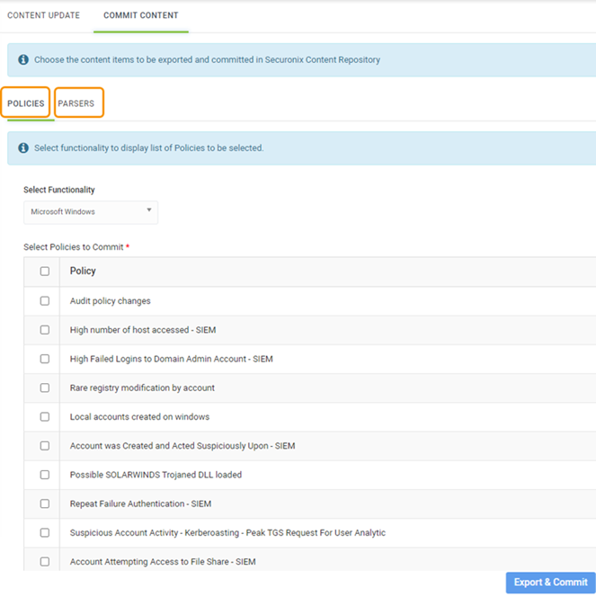
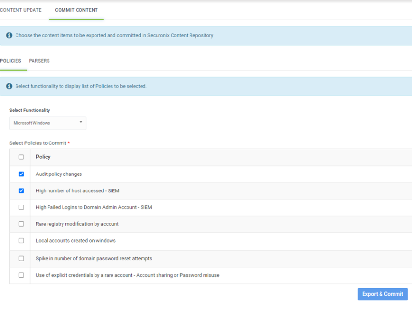

# Commit Content
When you commit your content, all information required for selected policies and parsers are committed. However, you can decide if you want to commit any supporting information or not. The supporting information for policies are tier-2 checks and workflow, and for parser is data dictionary.

## Committing Policy
To commit policies to the Securonix content library, perform the following:

1. Navigate to Menu > Admin > Content Management. The Content Management screen is displayed.

2. Click Commit Content. The Commit Content section is displayed.
3. Select a functionality to commit policies in the Select Functionality drop-down list.
4. Select policies that you want to commit.

5. Select Export & Commit. The Commit Policy screen displays the list of files that will be committed and an option to select supporting content.

6. Enter the commit message and select any supporting content that you want to commit.

7. Click Commit. The policy is committed. Similarly, you can commit parsers.