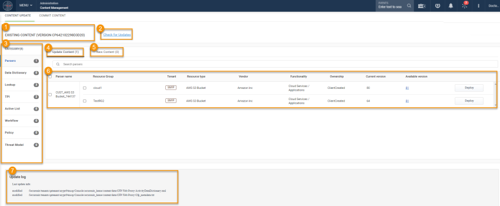
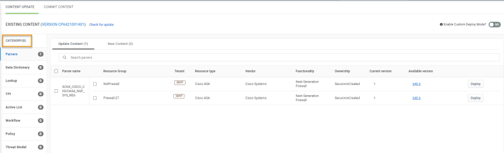

# Deploy Content

When you download content using Content Management, the local content folder is updated. If any new content is available, it is displayed in the content category. You have to deploy the content before you can use it in SNYPR.

You can download and deploy the content from the Securonix content library using Menu > Admin > Content Management. The Content Update screen is displayed.

The Content Update screen provides the following:

1. Existing Content: Displays the current content version deployed in SNYPR.
2. Check for Updates: Allows you to check and download the updated content.
3. Category: Lists content categories that you can download and deploy from Content Management. The 4. number indicates the total number of updates (updated content and new content).
4. Update Content: Lists if any updates are available for existing content.
5. New Content: Lists if any new content is available for deployment.
6. Available Content: Lists the content available for deployment. It also provides information such as current version of the content and the available version of the content.
7. Update Log: Displays the information of the last update.

## Downloading content
To download the content from the Securonix content library, perform the following:

1. Navigate to Menu > Admin > Content Management. The Content Management screen is displayed.
2. Click Check for Updates. If there are any updated or new content, the Category displays the total number of updates and new content.

