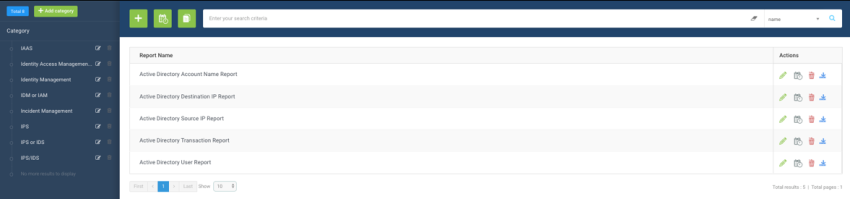
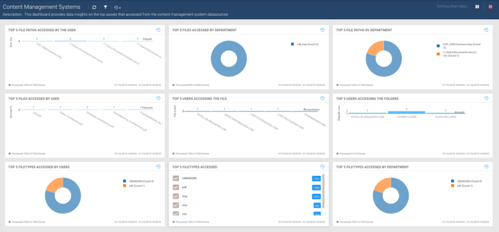
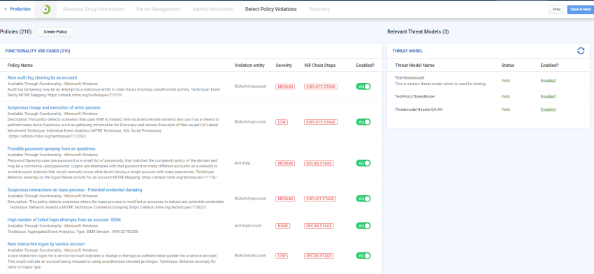

# Commit Content

SNYPR content is categorized by functionality. Functionality is a category that defines a datasource type. For example: Web Proxy is a functionality and Blue Coat Proxy is a datasource. By categorizing datasources by functionality, SNYPR can apply similar parsers, policies, and threat models to all datasources with similar functionality.

The functionality determines what content is available when you import the datasource. For a list of functionality supported by SNYPR, see Supported Functionality.

## Connectors and Parsers
A connector is used to bring data in SNYPR. The type of connector is called Collection Method. Each datasource can have multiple collection methods. You can use following types of connectors in SNYPR:

* API connections: Stream data from a datasource.
* Syslog event messages: Stream from a logging server or import as a file.
* File: Upload a delimited, Regex, JSON, etc. file from a local machine or RIN.
Each connector includes a parser that normalizes data so it can be easily read and translated by a computer. The type of parser is called the Format. Some parsing techniques used in SNYPR are: 

* Delimited fields (pipe, comma, etc)
* Capturing Groups
* Common Event Format (CEF)
* Key-Value Pair

SNYPR 6.4 includes Data Dictionary that provides consistent and easy to understand labels for data ingested from various datasources. These labels provide uniformity to data ingested from multiple datasources within a functionality.



# Reports

This is tab **Reports** content.

SNYPRContent includes custom reports for each functionality that provide transparency into the activity on your network to identify security issues and meet compliance requirements.





# Dashboards

This is tab **Dashboards** content.

SNYPRContent features custom dashboards that visualize the most relevant information for each functionality to monitor compliance issues and gain data insights into various types of policy violations and threats in your environment.





# Policies

This is tab **Policies** content.

Policies are the checks run on each device to detect threat indicators. You can enable, disable, or delete policies when you import the datasource.


